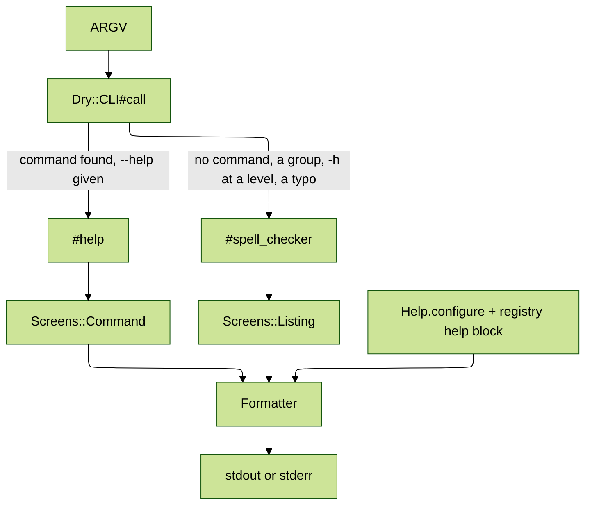

# dry-cli-help

[](https://github.com/kigster/dry-cli-help/actions/workflows/main.yml) 

Configurable, wrapped, colored help screens for [dry-cli](https://github.com/dry-rb/dry-cli) applications.

> [!NOTE]
> The design, the settings and every decision behind them are in [SPECIFICATION.md](SPECIFICATION.md).

dry-cli prints help as it finds it: no title, no description of the program, no color, one line per description however long, and commands sorted alphabetically. This gem keeps the command structure you already declared and changes only what the user reads before a command runs. Progress bars, spinners and error panels belong in `dry-cli-ui`.

## Before and after

`taxlibris compile -h` with dry-cli alone:

```text
Command:
  taxlibris compile

Usage:
  taxlibris compile RULES [OUTPUT]

Description:
  Compile tax rules

Arguments:
  RULES                             # REQUIRED Rule file to compile
  OUTPUT                            # Where to write the compiled rules

Options:
  --format=VALUE, -f VALUE          # Output format: (json/yaml), default: "json"
  --[no-]strict                     # Treat warnings as errors
  --help, -h                        # Print this help
```

With `require "dry/cli/help"`:

```text
USAGE
  taxlibris compile RULES [OUTPUT] [OPTIONS]

DESCRIPTION
  Compile tax rules

ARGUMENTS
  RULES               Rule file to compile (required)
  OUTPUT              Where to write the compiled rules

OPTIONS
  -f, --format=VALUE  Output format (one of: json, yaml; default: "json")
  --[no-]strict       Treat warnings as errors
  -h, --help          Show help
```

Headings are bold and yellow, commands green, options and arguments cyan, and every description wraps to the terminal with a hanging indent.

## Installation

```bash
gem install dry-cli-help
```

Or add `gem "dry-cli-help"` to your `Gemfile`.

## Usage

Require it after dry-cli. That alone changes every help screen in the process.

```ruby
require "dry/cli"
require "dry/cli/help"
```

Describe the program in the registry:

```ruby
module Taxlibris
  module CLI
    extend Dry::CLI::Registry

    help do
      title "Taxlibris"

      description <<~TEXT
        Compile, validate, and evaluate tax rules.
      TEXT

      epilogue "Documentation: https://example.com/taxlibris"

      color :auto
      width :terminal
      wrap true
    end

    register "compile", Compile
    register "validate", Validate
    register "evaluate", Evaluate
    register "version", Version, aliases: ["--version", "-v"]
  end
end
```

`taxlibris -h` then prints:

```text
Taxlibris

Compile, validate, and evaluate tax rules.

USAGE
  taxlibris COMMAND [OPTIONS]

COMMANDS
  compile        Compile tax rules
  validate       Validate the rule corpus
  evaluate       Evaluate a tax return
  version        Show version

OPTIONS
  -h, --help     Show help
  -v, --version  Show version

Documentation: https://example.com/taxlibris
```

A command reachable as `--version` lists under Options by its dashed names.

Settings for the whole process go through `configure`. A registry's `help` block overrides them:

```ruby
Dry::CLI::Help.configure do |config|
  config.width = 100
  config.color = false
end
```

A `help` block that takes an argument receives the configuration instead, so `help { |h| h.title = "Taxlibris" }` works too.

## Settings

| Setting                       | Values                            | Default         |
|*------------------------------|*----------------------------------| ---------------*|
| `title`                       | String                            | none            |
| `description`                 | String                            | none            |
| `epilogue`                    | String                            | none            |
| `color`                       | `true`, `false`, `:auto`          | `:auto`         |
| `wrap`                        | `true`, `false`                   | `true`          |
| `width`                       | `:terminal`, Integer              | `:terminal`     |
| `margin`                      | Integer                           | `0`             |
| `exit_code_without_arguments` | 0 to 255                          | `1`             |
| `banner_on_subcommands`       | `true`, `false`                   | `false`         |
| `heading_case`                | `:upcase`, `:capitalize`, `:none` | `:upcase`       |
| `command_order`               | `:registration`, `:alphabetical`  | `:registration` |

`color :auto` colors a terminal and honors [`NO_COLOR`](https://no-color.org). `width :terminal` reads `COLUMNS`, then the console, then falls back to 80, and `margin` keeps columns free at the right edge.

Running the program with no command prints the top-level help and exits 1, as dry-cli does. `exit_code_without_arguments 0` prints it to stdout and exits 0 instead. `-h` and `--help` always exit 0.

### Headings, sections and groups

```ruby
help do
  heading :commands, "Available commands"
  heading_case :capitalize

  group "Rules", "compile", "validate"
  group "Returns", "evaluate"

  hide :examples
  sections :banner, :usage, :commands, :options, :epilogue
end
```

- `heading` replaces one section's heading text.
- `group` lists commands under a heading of their own, in the order given. Ungrouped commands stay under Commands. A group inside a group names the full path, such as `"db migrate"`.
- `sections` sets the order; a section left out is hidden. `hide` hides sections without restating the order.

The sections are `banner`, `usage`, `description`, `commands`, `subcommands`, `arguments`, `options`, `examples` and `epilogue`. Each screen prints the ones that apply to it.

### Styles

```ruby
help do
  style :heading, :bold, :bright_blue
  style :comment            # no styles: print it plain
end
```

The styled elements are `title`, `heading`, `command`, `argument`, `option` and `comment`, the last being the part of an example after the first `#` surrounded by spaces, as in `"rules.form # compile one file"`.

### The Colors module

Every style is also available to your own code:

```ruby
class Deploy < Dry::CLI::Command
  include Dry::CLI::Help::Colors

  def call(**)
    puts green("Deployed.")
    puts red.bold("Rolled back.")
  end
end
```

The methods are the eight colors `black red green yellow blue magenta cyan white`, their `bright_` forms, the `on_` and `on_bright_` backgrounds, and `clear bold dim italic underline inverse hidden strikethrough`. `Dry::CLI::Help::Colors.enabled = false` turns them all off.

## How it works

The gem prepends one module to `Dry::CLI`, overriding the two private methods dry-cli prints help from. It does not replace `Dry::CLI::Banner` or `Dry::CLI::Usage`.



Both methods are `@api private` in dry-cli. `spec/dry/cli/help/dry_cli_contract_spec.rb` asserts every internal the gem reads, so a dry-cli release that moves one fails this suite, naming what moved.

## Development

```bash
just install     # bundle install
just test        # the suite; a full run enforces 100% line and branch coverage
just lint        # rubocop
just ci          # both
just lefthook    # every pre-commit hook against every file
just format      # rubocop -a, then mdformat --wrap no on every Markdown file
bin/console      # IRB with the gem loaded
```

## Contributing

Bug reports and pull requests are welcome at <https://github.com/kigster/dry-cli-help>.

> [!WARNING]
> The `dry-` prefix and the `Dry::CLI::Help` namespace do not imply endorsement by dry-rb. This is an independent gem that extends theirs.

## License

MIT. See [LICENSE.txt](LICENSE.txt).
