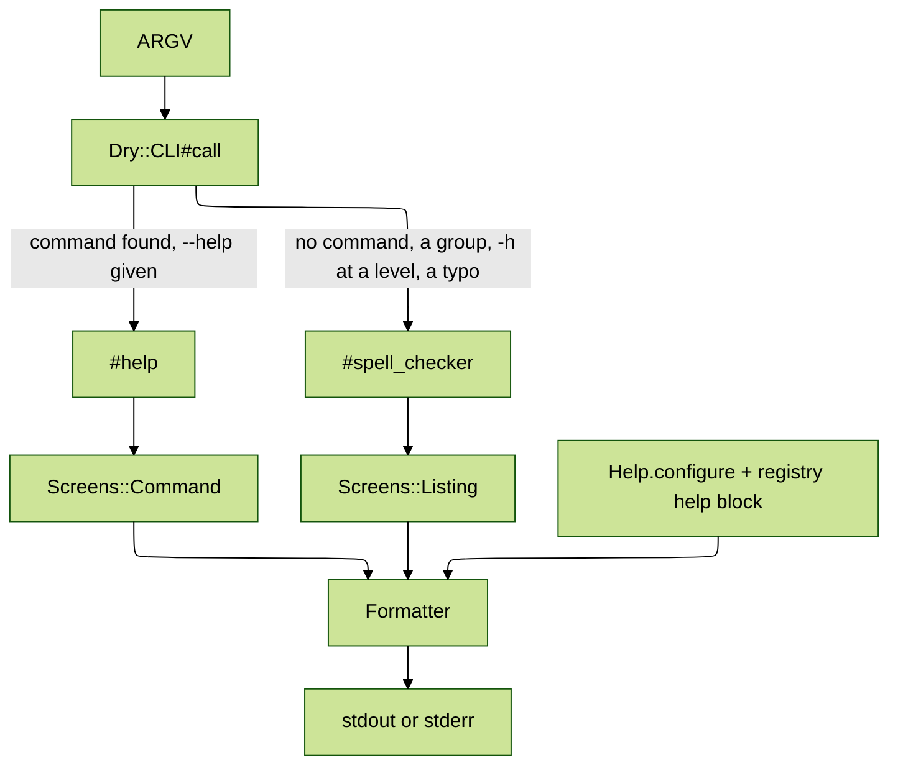

# dry-cli-help

[](https://github.com/kigster/dry-cli-help/actions/workflows/main.yml) 

Configurable, wrapped, colored help screens for [dry-cli](https://github.com/dry-rb/dry-cli) applications.

> [!NOTE]
> The design, the settings and every decision behind them are in [SPECIFICATION.md](SPECIFICATION.md).

dry-cli prints help as it finds it: no title, no description of the program, no color, one line per description however long, and commands sorted alphabetically. This gem keeps the command structure you already declared and changes only what the user reads before a command runs. Progress bars, spinners and error panels belong in `dry-cli-ui`.

## Before and after

`my-cli compile -h` with dry-cli alone:

```text
Command:
  my-cli compile

Usage:
  my-cli compile RULES [OUTPUT]

Description:
  Compile tax rules

Arguments:
  RULES                             # REQUIRED Rule file to compile
  OUTPUT                            # Where to write the compiled rules

Options:
  --format=VALUE, -f VALUE          # Output format: (json/yaml), default: "json"
  --[no-]strict                     # Treat warnings as errors
  --help, -h                        # Print this help
```

With `require "dry/cli/help"`:

```text
USAGE
  my-cli compile RULES [OUTPUT] [OPTIONS]

DESCRIPTION
  Compile tax rules

ARGUMENTS
  RULES               Rule file to compile (required)
  OUTPUT              Where to write the compiled rules

OPTIONS
  -f, --format=VALUE  Output format (one of: json, yaml; default: "json")
  --[no-]strict       Treat warnings as errors
  -h, --help          Show help
```

Headings are bold and yellow, commands green, options and arguments cyan, and every description wraps to the terminal with a hanging indent.

Although, it is best to show them side by side as a screenshot: this script `rbcheck` is in the `examples` folder of the gem.

| Standard dry-cli Help Screen                    | Require `dry/cli/help`                   |
| :---------------------------------------------- | :--------------------------------------- |
|  |  |
|                                                 |                                          |

## Installation

```bash
gem install dry-cli-help
```

Or add `gem "dry-cli-help"` to your `Gemfile`.

## Usage

Require it after dry-cli. That alone changes every help screen in the process.

```ruby
require "dry/cli"
require "dry/cli/help"
```

Then make every setting once, in one block, before the CLI runs. Your registry, commands and options stay plain dry-cli: the gem adds nothing to them, so you can add or remove it without touching a command.

```ruby
Dry::CLI::Help.configure do
  title "MyCLI"

  description <<~TEXT
    This utility does something very important.
  TEXT

  epilogue "Documentation: https://example.com/my-cli"

  color :auto
  width :terminal
  wrap true
end

module My
  module CLI
    extend Dry::CLI::Registry

    register "compile", Compile
    register "validate", Validate
    register "evaluate", Evaluate
    register "version", Version, aliases: ["--version", "-v"]
  end
end
```

`my-cli -h` then prints:

```text
MyCLI

Compile, validate, and evaluate rules.

USAGE
  my-cli COMMAND [OPTIONS]

COMMANDS
  compile        Compile tax rules
  validate       Validate the rule corpus
  evaluate       Evaluate a tax return
  version        Show version

OPTIONS
  -h, --help     Show help
  -v, --version  Show version

Documentation: https://example.com/my-cli
```

A command reachable as `--version` lists under Options by its dashed names.

A block that takes an argument receives the configuration instead of running against it:

```ruby
Dry::CLI::Help.configure do |config|
  config.width = 100
  config.color = false
end
```

## Examples

The [`examples`](examples) folder holds three single-file tools built on dry-cli. Each one loads and configures this gem only when you pass `--with-dry-cli-help`, or `-w` for short, so you can run the same command both ways and compare:

```bash
examples/rbcheck -h                      # dry-cli's own help
examples/rbcheck -h --with-dry-cli-help  # the same help, through this gem
```

`examples/rbcheck` has two commands, `version` and `check-ruby-syntax [DIR]`. Condensed:

```ruby
#!/usr/bin/env ruby
require "dry/cli"

if [ARGV.delete("--with-dry-cli-help"), ARGV.delete("-w")].any?
  require "dry/cli/help"

  Dry::CLI::Help.configure do
    title "RBCheck"
    description "Small checks for Ruby projects."
    epilogue "Report bugs at https://example.com/rbcheck/issues"
  end
end

module Rbcheck
  extend Dry::CLI::Registry

  class Version < Dry::CLI::Command
    desc "Print the version"

    def call(**) = puts("rbcheck 1.0.0")
  end

  class CheckRubySyntax < Dry::CLI::Command
    desc "Check every Ruby file under a directory for syntax errors, and report "\
         "each file that fails to parse with its line number"

    argument :dir, desc: "Directory to scan", default: "."
    option :exclude, type: :array, desc: "Glob patterns to skip, such as vendor/**"
    option :quiet, type: :boolean, default: false, aliases: ["-q"],
           desc: "Print only the files that fail"

    example ["lib # check one directory", "--exclude=vendor/** # skip vendored gems"]

    def call(dir:, quiet:, exclude: [], **)
      # ... parses every file under dir with Prism ...
    end
  end

  register "version", Version, aliases: ["--version", "-v"]
  register "check-ruby-syntax", CheckRubySyntax
end

Dry::CLI.new(Rbcheck).call
```

Every screen below comes from running it in an 80-column terminal.

### `rbcheck -h`

dry-cli alone prints a list of commands and exits 1. Also note the lack of wrapping on the long description.

```text
Commands:
  rbcheck check-ruby-syntax [DIR]                 # Check every Ruby file under a directory for syntax errors, and report each file that fails to parse with its line number
  rbcheck version                                 # Print the version
```

With this gem in play it exits 0 and prints:

```text
RB	check

Small checks for Ruby projects.

USAGE
  rbcheck COMMAND [OPTIONS]

COMMANDS
  version            Print the version
  check-ruby-syntax  Check every Ruby file under a directory for syntax errors,
                     and report each file that fails to parse with its line
                     number

OPTIONS
  -h, --help         Show help
  -v, --version      Print the version

Report bugs at https://example.com/rbcheck/issues
```

- The title, description and epilogue come from the `configure` block.
- Commands list in the order they were registered, not alphabetically.
- The long description wraps to the terminal under its own column.
- `version` is also reachable as `--version` and `-v`, so it lists under Options too. dry-cli never shows those aliases.

### `rbcheck check-ruby-syntax -h`

dry-cli alone:

```text
Command:
  rbcheck check-ruby-syntax

Usage:
  rbcheck check-ruby-syntax [DIR]

Description:
  Check every Ruby file under a directory for syntax errors, and report each file that fails to parse with its line number

Arguments:
  DIR                               # Directory to scan

Options:
  --exclude=VALUE1,VALUE2,..        # Glob patterns to skip, such as vendor/**
  --[no-]quiet, -q                  # Print only the files that fail, default: false
  --help, -h                        # Print this help

Examples:
  rbcheck check-ruby-syntax lib # check one directory
  rbcheck check-ruby-syntax --exclude=vendor/** # skip vendored gems
```

With this gem:

```text
USAGE
  rbcheck check-ruby-syntax [DIR] [OPTIONS]

DESCRIPTION
  Check every Ruby file under a directory for syntax errors, and report each
  file that fails to parse with its line number

ARGUMENTS
  DIR                         Directory to scan (default: ".")

OPTIONS
  --exclude=VALUE1,VALUE2,..  Glob patterns to skip, such as vendor/**
  -q, --[no-]quiet            Print only the files that fail (default: false)
  -h, --help                  Show help

EXAMPLES
  rbcheck check-ruby-syntax lib             check one directory
  rbcheck check-ruby-syntax --exclude=vendor/**
                                            skip vendored gems
```

- The `Command:` section repeats the usage line, so it is gone, and the usage line shows that the command takes options.
- The argument's default of `"."` shows up; dry-cli leaves it out.
- Short aliases come first (`-q, --[no-]quiet`), and every description lines up in one column instead of trailing a `#`.
- Each example's comment moves into a column of its own. An example longer than that column puts its comment on the next line.

In a terminal the headings print bold yellow, usage lines, commands and examples green, arguments and options cyan, and example comments bold black.

`examples/todo` shows nested commands, custom headings and a `styles` block. `examples/deploy` shows a fixed width, a banner above command help, reordered sections and help without a command exiting 0. [`examples/README.md`](examples/README.md) lists what each one demonstrates.

## Settings

| Setting                       | Values                           | Default         | What it does                                                                                                              |
| ----------------------------- | -------------------------------- | --------------- | ------------------------------------------------------------------------------------------------------------------------- |
| `title`                       | String                           | none            | Prints a bold first line at the top of the top-level help                                                                 |
| `description`                 | String                           | none            | Prints paragraphs under the title, reflowed to the wrap width                                                             |
| `epilogue`                    | String                           | none            | Prints paragraphs at the very end of the top-level help                                                                   |
| `color`                       | `true`, `false`, `:auto`         | `:auto`         | Paints headings, commands, arguments and options; `:auto` paints only a terminal                                          |
| `wrap`                        | `true`, `false`                  | `true`          | Wraps descriptions with a hanging indent; `false` prints each one on a single line as written                             |
| `width`                       | `:terminal`, Integer             | `:terminal`     | Sets the column text wraps at; `:terminal` follows the terminal's width                                                   |
| `margin`                      | Integer                          | `0`             | Keeps that many columns free at the right edge when `width` is `:terminal`                                                |
| `exit_code_without_arguments` | 0 to 255                         | `1`             | Sets the exit status of `my-cli` or `my-cli db` run with no command; `0` also prints the help to stdout instead of stderr |
| `banner_on_subcommands`       | `true`, `false`                  | `false`         | Prints the title and description above command help and group listings too, not only above the top-level help             |
| `command_order`               | `:registration`, `:alphabetical` | `:registration` | Lists commands in the order you registered them, or sorted by name as dry-cli does                                        |

`color :auto` colors a terminal and honors [`NO_COLOR`](https://no-color.org). `width :terminal` reads `COLUMNS`, then the console, then falls back to 80, and `margin` keeps columns free at the right edge.

Running the program with no command prints the top-level help and exits 1, as dry-cli does. `exit_code_without_arguments 0` prints it to stdout and exits 0 instead. `-h` and `--help` always exit 0.

### Headings, sections and groups

```ruby
Dry::CLI::Help.configure do
  heading :commands, "Available commands"

  group "Rules", "compile", "validate"
  group "Returns", "evaluate"

  hide :examples
  sections :banner, :usage, :commands, :options, :epilogue
end
```

- `heading` replaces one section's heading text. How headings are cased belongs to their style, below.
- `group` lists commands under a heading of their own, in the order given. Ungrouped commands stay under Commands. A group inside a group names the full path, such as `"db migrate"`.
- `sections` sets the order; a section left out is hidden. `hide` hides sections without restating the order.

The sections are `banner`, `usage`, `description`, `commands`, `subcommands`, `arguments`, `options`, `examples` and `epilogue`. Each screen prints the ones that apply to it.

### Styles

Every element's look is declared together, in one `styles` block inside `configure`:

```ruby
Dry::CLI::Help.configure do
  styles do
    title           :bold
    heading         :bold, :yellow, case: :UPPERCASE
    usage           :green
    command         :green
    argument        :cyan
    option          :cyan
    example         :green
    example_comment :bold, :black
  end
end
```

Those are the defaults. Name only the elements you want to change; a line with no styles, such as `example_comment`, prints that element plain.

| Element           | Applies to                                                                                           |
| ----------------- | ---------------------------------------------------------------------------------------------------- |
| `title`           | The banner title                                                                                     |
| `heading`         | Every section and group heading                                                                      |
| `usage`           | Every usage line, whole                                                                              |
| `command`         | Command names in a list                                                                              |
| `argument`        | Argument names                                                                                       |
| `option`          | Option names                                                                                         |
| `example`         | The command line of an example                                                                       |
| `example_comment` | The part of an example after the first `#` surrounded by spaces, as in `"lib # check one directory"` |

`heading` alone takes `case:`, one of `:UPPERCASE`, `:Capitalize`, `:lowercase` or `:as_is`, each written the way it cases. `:Capitalize` raises only the first letter. `heading case: :as_is` with no styles changes the case and keeps the colors.

### The Colors module

Every style is also available to your own code:

```ruby
class Deploy < Dry::CLI::Command
  include Dry::CLI::Help::Colors

  def call(**)
    puts green("Deployed.")
    puts red.bold("Rolled back.")
  end
end
```

The methods are the eight colors `black red green yellow blue magenta cyan white`, their `bright_` forms, the `on_` and `on_bright_` backgrounds, and `clear bold dim italic underline inverse hidden strikethrough`. `Dry::CLI::Help::Colors.enabled = false` turns them all off.

## How it works

The gem prepends one module to `Dry::CLI`, overriding the two private methods dry-cli prints help from. It does not replace `Dry::CLI::Banner` or `Dry::CLI::Usage`.



Both methods are `@api private` in dry-cli. `spec/dry/cli/help/dry_cli_contract_spec.rb` asserts every internal the gem reads, so a dry-cli release that moves one fails this suite, naming what moved.

## Development

```bash
just install     # bundle install
just test        # the suite; a full run enforces 100% line and branch coverage
just lint        # rubocop
just ci          # both
just lefthook    # every pre-commit hook against every file
just format      # rubocop -a, then mdformat --wrap no on every Markdown file
bin/console      # IRB with the gem loaded
```

## Contributing

Bug reports and pull requests are welcome at <https://github.com/kigster/dry-cli-help>.

> [!WARNING]
> The `dry-` prefix and the `Dry::CLI::Help` namespace do not imply endorsement by dry-rb. This is an independent gem that extends theirs.

## License

MIT. See [LICENSE.txt](LICENSE.txt).
